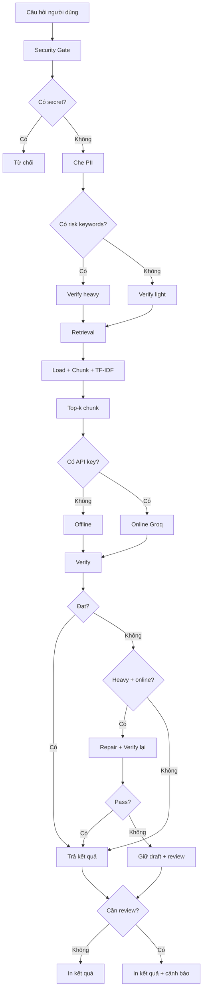

# Mini-RAG Internship Assistant

Một workflow nhỏ dùng **AI agent + skill + tools** để hỏi đáp trên bộ tài liệu thực tập.  
Mục tiêu là trả lời có căn cứ, có citation, biết khi nào phải kiểm chứng mạnh và không gửi dữ liệu nhạy cảm cho mô hình.

## 1. Bài toán thực tế

Trong thời gian thực tập, sinh viên thường phải tra cứu nhiều tài liệu:

- Quy định báo cáo và xin nghỉ.
- Quy ước code, branch, commit và pull request.
- Quy định bảo mật dữ liệu.
- Hướng dẫn xử lý sự cố.

Tìm thủ công tốn thời gian và dễ nhớ sai. Workflow này xây một mini-RAG để trả lời câu hỏi dựa **chỉ trên tài liệu nội bộ được cung cấp**.

## 2. Năng lực được thể hiện

- Agent giải bài toán nhiều bước.
- Skill riêng định hướng cách AI trả lời.
- Hai tool nội bộ: `retrieval_tool` và `verify_tool`.
- Bước verify nhẹ/nặng rõ ràng.
- Kiểm tra secret, PII và prompt injection trước khi gọi AI.
- Bộ câu hỏi đánh giá retrieval, keyword coverage và citation.
- Repo có README, dữ liệu mẫu và unit test.

## 3. Luồng hoạt động (Flow)

Dùng công cụ https://mermaid.live/ và paste nội dung bên dưới để xem sơ đồ:



### Các bước chính

1. **Security gate** (`security.py`)
   - Từ chối câu hỏi chứa API key, JWT hoặc private key.
   - Phát hiện câu lệnh cố ghi đè hướng dẫn như "bỏ qua hướng dẫn trước".
   - Che email và số điện thoại trước khi gửi dữ liệu tới mô hình.

2. **Risk router** (`agent.py:classify_verify_level`)
   - Verify nhẹ (`light`): câu hỏi tra cứu quy trình thông thường.
   - Verify nặng (`heavy`): bảo mật, phân quyền, credential, production, migration hoặc quyết định có ảnh hưởng lớn.

3. **Retrieval tool** (`retrieval_tool.py`)
   - Đọc file `.md` và `.txt` từ `data/docs/`.
   - Sanitize: che secret/PII trong tài liệu trước khi chunk.
   - Chunk: chia tài liệu thành section (theo `##`), nếu dài quá 900 ký tự thì split tiếp.
   - TF-IDF vectorize + cosine similarity — viết bằng Python standard library.
   - Không đưa chunk có dấu hiệu prompt injection vào context.

4. **Answer agent** (`agent.py`)
   - Đọc `skills/rag-answer/SKILL.md` làm instruction.
   - `_build_prompt()`: ghép question + sources + verify_level vào prompt.
   - Offline mode: `_offline_answer()` dùng token overlap để extract câu từ chunk tốt nhất.
   - Online mode: gọi Groq Responses API qua `llm_client.generate()`.
   - Bắt buộc citation dạng `[ten-file.md#cN]`.
   - Nói rõ "không tìm thấy" nếu tài liệu không đủ.

5. **Verify tool** (`verify_tool.py`)
   - Kiểm tra citation có tồn tại trong context.
   - Tính groundedness (token overlap giữa answer và source).
   - Dùng ngưỡng cao hơn cho verify nặng (`0.35` vs `0.20`).
   - Nếu verify nặng chưa đạt, agent tạo bản sửa rồi kiểm tra lại.

6. **Repair loop** (`agent.py`)
   - Khi `verify_level=heavy` và verification thất bại và có API key:
     - `_repair_prompt()` → generate lại → verify lại.
     - Nếu vẫn thất bại hoặc lỗi LLM → giữ draft cũ + yêu cầu human review.

## 4. Cấu trúc repo

```text
mini_rag_internship_agent/
├── README.md
├── .env.example
├── .gitignore
├── skills/
│   └── rag-answer/
│       └── SKILL.md
├── data/
│   ├── docs/
│   │   ├── coding_rules.md
│   │   ├── internship_policy.md
│   │   ├── security_policy.md
│   │   └── database_guidelines.md
│   └── eval/
│       └── questions.jsonl
├── src/
│   ├── __init__.py
│   ├── agent.py
│   ├── cli.py
│   ├── evaluate.py
│   ├── llm_client.py
│   ├── retrieval_tool.py
│   ├── security.py
│   └── verify_tool.py
└── tests/
    ├── test_retrieval.py
    ├── test_security.py
    └── test_verify.py
```

## 5. Chuẩn bị

Yêu cầu:

- Python 3.10 trở lên.
- Không cần package ngoài để chạy retrieval, security, verify và đánh giá offline.
- Muốn dùng AI thật, cần Groq API key và model hỗ trợ Responses API.

Tạo biến môi trường:

```bash
cp .env.example .env
```

Linux/macOS:

```bash
export GROQ_API_KEY="gsk_..."
export GROQ_MODEL="openai/gpt-oss-20b"
```

PowerShell:

```powershell
$env:GROQ_API_KEY="gsk_..."
$env:GROQ_MODEL="openai/gpt-oss-20b"
```

Không commit file `.env`.

### Cấu hình bằng file `.env`

Project tự đọc file `.env` ở thư mục gốc. Tạo file từ mẫu:

```bash
cp .env.example .env
```

Sau đó điền `GROQ_API_KEY`. File `.env` đã được thêm vào `.gitignore`.

## 6. Cách chạy

### Hỏi đáp bằng Groq API

```bash
python -m src.cli ask "Báo cáo tuần phải nộp khi nào?"
```

### Chạy không có API key

Khi chưa có Groq API key, agent dùng chế độ extractive fallback để kiểm thử toàn bộ pipeline:

```bash
python -m src.cli ask "Quy tắc đặt tên branch là gì?" --offline
```

### Ép mức verify

```bash
python -m src.cli ask "Có được đưa API key vào source code không?" --verify heavy
```

### Chạy bộ đánh giá

```bash
python -m src.evaluate --offline
```

Lưu báo cáo:

```bash
python -m src.evaluate --offline --output evaluation_report.md
```

### Chạy unit test

```bash
python -m unittest discover -s tests -v
```

## 7. Verify nhẹ và verify nặng

| Mức | Ví dụ | Cách xử lý |
|---|---|---|
| Nhẹ | Hạn nộp báo cáo, cách đặt tên branch | Kiểm citation và mức khớp nội dung cơ bản |
| Nặng | API key, phân quyền, production, migration, sự cố dữ liệu | Ngưỡng groundedness cao hơn, bắt buộc citation hợp lệ, tự sửa một lần và yêu cầu human review nếu vẫn trượt |

Quy tắc: **Không hiểu, không có căn cứ hoặc có nguy cơ lộ dữ liệu thì không dùng câu trả lời cho việc thật.**

## 8. Bảo mật

- Không gửi secret vào prompt.
- Không ghi toàn bộ prompt/context nhạy cảm vào log.
- Chỉ gửi top-k chunk cần thiết thay vì toàn bộ kho tài liệu.
- Từ chối prompt injection rõ ràng từ câu hỏi.
- Bỏ chunk tài liệu chứa chỉ dẫn cố điều khiển mô hình.
- Che email và số điện thoại.
- `.env`, index cục bộ và báo cáo chứa dữ liệu nội bộ không được commit.
- API key chỉ đọc từ biến môi trường.

## 9. Đánh giá chất lượng

Bộ đánh giá tại `data/eval/questions.jsonl` kiểm tra:

- `retrieval_hit@k`: có lấy đúng tài liệu hay không.
- `keyword_coverage`: câu trả lời có chứa ý chính mong đợi.
- `citation_validity`: citation có trỏ tới chunk được cung cấp.
- `verification_pass_rate`: tỷ lệ câu trả lời vượt verifier.

Bộ đánh giá nhỏ chỉ là lưới an toàn ban đầu, không thay thế review của con người cho tác vụ verify nặng.

## 10. Vì sao dùng tool thay vì MCP?

Bài toán chạy trên một thư mục tài liệu nhỏ trong repo, vì vậy retrieval và verify tool cục bộ đủ đơn giản, dễ kiểm thử và giảm bề mặt truy cập dữ liệu. Khi tài liệu nằm trên Google Drive, Notion hoặc kho nội bộ, có thể thay `retrieval_tool` bằng MCP server tương ứng nhưng vẫn giữ nguyên security gate, skill và verifier.

## 11. Giới hạn

- TF-IDF phù hợp demo nhỏ nhưng không hiểu ngữ nghĩa tốt như embedding.
- Groundedness heuristic có thể phạt câu diễn đạt lại bằng từ đồng nghĩa.
- Dữ liệu đánh giá mẫu còn ít.
- Trước khi dùng production cần thêm xác thực người dùng, phân quyền tài liệu, audit log an toàn và kiểm thử tấn công.
